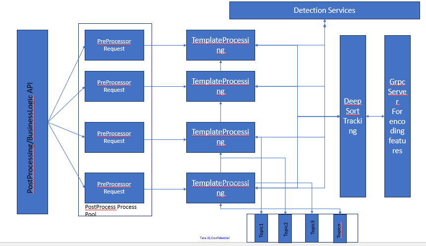

# Introduction 
This is a Postprocessing repo. 

# Architecture

1. Postprocess APi is hosted using uvicorn
2. Each time API is getting hit, requests are pushed to the internal queue
3. To make the processing fast, we are running multiple process pool with thread pools to process the request faster
4. Each threadpool has templates running, which will be switched based on the reuest coming from preprocess
4. Each template have serveral usecases, and each usecases have detection model assigned. Once the model call the detection api, it will get detection result as output, which is further send to the tracking module. 
5. Tracking module require, features encoding. Features Encoder is running as GRPC
6. Once the tracking and other business logic is processed. Output is further send to the kafka topic.
# Dependency
1. This Module is dependent on the https://tatacommiot@dev.azure.com/tatacommiot/Video%20Based%20IoT/_git/vd-iot-dataapiservice
2. This module also needs kafka broker
3. This module will be dependent on various detection service and grpc server(repo is not created yet)

# Installation
1. Install Python3.9 
2. Install redis-server
3. poetry install

# Run App
python3 app.py

# Docker 
To-do: Docker Implementation